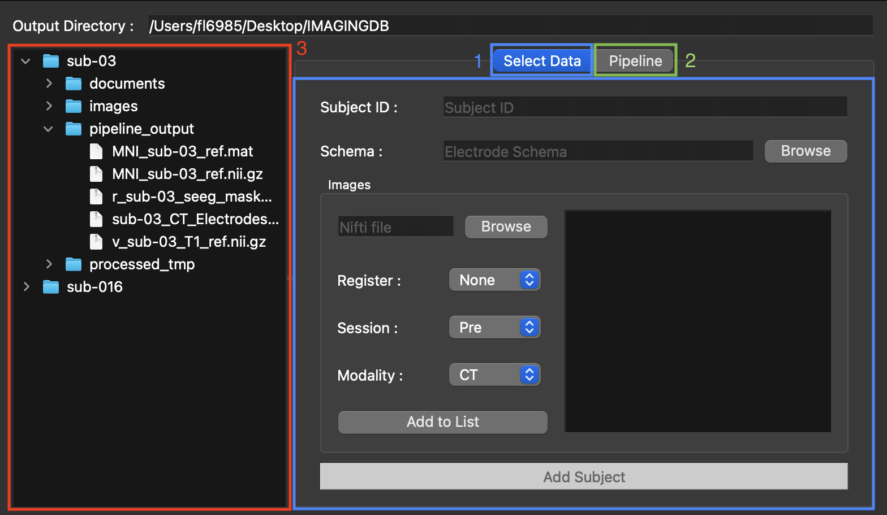

# CiCLONE User Guide

**CiCLONE** (Cico Cardinale's Localization Of Neuro-electrodes) - A neuroimaging application for localizing implanted electrodes in epilepsy patients using automated CT/MRI processing pipelines.

---

## Getting Started

### Initial Setup

1. **File > New Output Directory**
   - Choose a name and location for your workspace
   - All subject data will be stored here

2. **File > Open Output Directory**
   - Open an existing workspace

### System Requirements

**Required Software:**
- **FSL** - Set environment variable: `FSLDIR=/path/to/fsl`
- **FreeSurfer** (optional) - Set: `FREESURFER_HOME=/path/to/freesurfer`

**Supported Formats:**
- Medical images: NIfTI (`.nii`, `.nii.gz`)
- Schemas: JPEG, PNG, TIFF, PowerPoint (`.pptx`)
- Coordinates: JSON (3D Slicer format)

---

## Main Interface

### Three Main Areas

1. **Select Data** - Create subjects and import images
2. **Pipeline** - Run processing workflows
3. **Subject Tree** - Browse subjects and files



---

## Working with Subjects

### Create New Subject

1. Go to **Select Data** tab
2. Enter **Subject Name** (e.g., "Patient001")
3. Add medical images and schemas
4. Click **Add Subject**

**Folder Structure Created:**
```
SubjectName/
├── images/
│   ├── preop/
│   │   ├── ct/       # Pre-op CT scans
│   │   ├── mri/      # Pre-op MRI scans
│   │   └── pet/      # Pre-op PET scans
│   └── postop/
│       ├── ct/       # Post-op CT scans
│       ├── mri/      # Post-op MRI scans
│       └── pet/      # Post-op PET scans
├── documents/        # Electrode schemas
├── processed_tmp/    # Intermediate files
└── pipeline_output/  # Final results
```

### Add Files to Existing Subject

1. Select subject from tree view
2. Go to **Select Data** tab
3. Add new images
4. Click **Add Subject**

---

## Importing Medical Images

### Image Import

1. **Add Medical Image** button
2. **Specify Properties:**
   - **Session**: Pre-operative or Post-operative
   - **Modality**: CT, MRI, or PET
   - **Registration Target** (optional): Auto-register to another image

3. **Add Schemas** (optional)
   - JPG, PNG, TIFF, PowerPoint files
   - PowerPoint auto-converted to images and markdown

4. Click **Add Subject**
   - Images automatically cropped, registered, and renamed

### Standard File Names

| Image Type | Filename |
|-----------|----------|
| Pre-op CT | `SubjectName_CT_Bone` |
| Post-op CT | `SubjectName_CT_Electrodes` |
| Pre-op MRI | `SubjectName_T1` |
| Post-op MRI | `SubjectName_T1_post` |

**Processing Suffixes:**
- `_C` - Cropped
- `_N` - Nudged (manual adjustment)
- `_R2S` - Reoriented to standard

---

## Running Processing Pipelines

### Available Pipelines

1. **CTpre / CTpost** - For CT-based electrode localization
2. **MRIpre / MRIpost** - For MRI-based localization

### Pipeline Workflow

1. **Select Subjects** - Check subjects in tree view
2. **Choose Pipeline** - Select CT or MRI configuration
3. **Select Stages** - Check specific stages or run all
4. **Execute** - Click **Run Selected Stages** or **Run All Stages**
5. **Monitor Progress** - View logs (Enable **Verbose Mode**: Ctrl+V for details)
6. **Review Results** - Check `SubjectName/pipeline_output/`

### Pipeline Stages (CT Pipeline)

| Stage | Description |
|-------|-------------|
| **visual_inspection** | FSLeyes viewer, nudge adjustments, cropping |
| **coregistration** | Register all images to common space |
| **extract_electrodes** | Isolate metallic artifacts (electrodes) |
| **apply_mask** | Apply brain mask to electrode image |
| **mni_registration** | Register to MNI standard space |
| **cortical_extraction** | FreeSurfer reconstruction (6-12 hours) |
| **export_outputs** | Copy results to `pipeline_output/` |

---

## Electrode Marking (Built-in GUI)

### Open Image Viewer

After pipeline processing:
1. Navigate to subject's `pipeline_output/` folder
2. Right-click electrode mask image (e.g., `r_SubjectName_seeg_masked.nii.gz`)
3. Select **Open with Image Viewer** or use File menu

### Mark Electrodes

1. **Load Images**
   - Electrode mask and anatomical references load automatically
   - Use overlay controls (⚙ button) to adjust visibility

2. **Create Electrode**
   - Enter electrode name (e.g., "A", "B", "C")
   - Select electrode type from dropdown
   - Click **Add Electrode**

3. **Set Entry and Tip Points**
   - Click on image to select coordinates
   - Click **Set Tip Point** (electrode tip inside brain)
   - Click **Set Entry Point** (where electrode enters skull)

4. **Generate Contacts**
   - Click **Process Coordinates**
   - Contacts automatically interpolated between tip and entry
   - Contacts appear in electrode tree

5. **Fine-tune Positions** (optional)
   - Enable movement: Click 🔐 button (changes to 🔓)
   - Drag markers directly on images
   - Lock when done: Click 🔓 (changes to 🔐)

### View Controls

- **Crosshairs** (toolbar) - Toggle crosshair overlay
- **Markers** (toolbar) - Show/hide electrode markers
- **Sliders** - Navigate through slices
- **Overlay Controls** (⚙) - Adjust image opacity and layers

### Save Coordinates

1. **Save Subject Space** - Click **Save File**
   - Saves to `pipeline_output/SubjectName_coordinates.json`

2. **Export to MNI Space** - Click **Export MNI**
   - Transforms coordinates to standard MNI space
   - Saves as `MNI_SubjectName_coordinates.json`

---

## Tips & Best Practices

### General

- **Verbose Logging**: Press **Ctrl+V** to toggle detailed debug messages
- **Visual Inspection**: Always review images in FSLeyes during `visual_inspection` stage
- **Naming**: Use consistent subject names (e.g., Patient001, Patient002)

### Image Quality

- Ensure good CT contrast
- Check for motion artifacts
- Pre-op and post-op images should have similar resolution

### Processing

- Import all images before running pipelines
- Don't skip `visual_inspection` stage
- Cortical reconstruction runs in background (6-12 hours)
- Application can be minimized during long processes

### Electrode Marking

- Mark tip point first (inside brain, deepest contact)
- Mark entry point second (skull entry, most superficial)
- Process coordinates to generate intermediate contacts
- Use crosshairs (toolbar button) for precise positioning
- Enable movement (🔓) only when adjusting specific electrodes

---

## Troubleshooting

### FSL/FreeSurfer Not Found

**Solution:** Set environment variables before launching:
```bash
export FSLDIR=/usr/local/fsl
export FREESURFER_HOME=/usr/local/freesurfer
```

### Images Won't Import

**Check:**
- File is valid NIfTI format (`.nii` or `.nii.gz`)
- File has read permissions
- No special characters in path

### Registration Failures

**Solutions:**
- Verify similar field of view between images
- Use `visual_inspection` to apply manual nudge
- Check that images are the expected modality

### Missing Output Files

**Check:**
- Review logs for error messages (enable verbose mode)
- Verify previous stages completed successfully
- Check disk space availability
- Look in `processed_tmp/` for intermediate files

---

## Informations

### Log Files

Enable verbose mode (**Ctrl+V**) to see detailed processing steps and error messages.

### Resources

- **FSL**: https://fsl.fmrib.ox.ac.uk/fsl/
- **FreeSurfer**: https://surfer.nmr.mgh.harvard.edu/
- **3D Slicer**: https://www.slicer.org/
